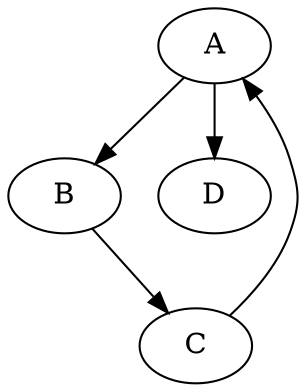

# Directed Graph Analysis Tool

A high-performance CLI tool for analyzing directed graphs using **Fagiolo clustering coefficients** and small-worldness metrics. Designed for code dependency graphs and other directed network structures.

## Features

- 🚀 **Optimized Performance**: Vectorized sparse matrix operations for large graphs
- 📊 **Comprehensive Metrics**: Basic graph statistics, path lengths, and degree distributions
- 🔬 **Fagiolo Clustering**: All five directed clustering coefficients (C^D, C^cyc, C^mid, C^in, C^out)
- 🌐 **Small-Worldness**: Compares against random graphs to detect small-world properties
- 📁 **CSV Export**: Single-row output with all metrics for easy integration
- ⚡ **Fast**: Handles graphs with thousands of nodes efficiently

## Installation

### Prerequisites

1. **Python 3.7+**

### Install Python Dependencies

```bash
# Clone or download this repository
cd directed-graph-analysis

# Create virtual environment (recommended)
python -m venv venv
source venv/bin/activate  # On Windows: venv\Scripts\activate

# Install dependencies
pip install -r requirements.txt
```

## Usage

### Basic Usage

```bash
python pipeline.py input.dot output.csv
```
## Extract .dot
Using depends (depends-0.9.7-package-20221104a)

```bash
.\depends.bat lang .\repos\repo_name .\depends-out\repo_name -f=dot -g=file -p=windows -s --type-filter=Import,Extend,Implement,Call,Create
```


### Advanced Options

```bash
# Specify number of random graphs for small-world comparison
python pipeline.py graph.dot results.csv --random-iterations 20 --per-node results-per-node.csv

# Quick analysis (fewer random graphs, faster)
python pipeline.py graph.dot output.csv -r 5

# Get help
python pipeline.py --help
```

### Example

```bash
# Analyze a code dependency graph
python pipeline.py dependency_graph.dot analysis_results.csv

# Output:
======================================================================
DIRECTED GRAPH ANALYSIS
======================================================================

Computing basic metrics...
Computing average path length...
Computing degree statistics...
Computing Fagiolo clustering coefficients...
  ✓ Saved 997 node records
Computing small-worldness (comparing to 10 random graphs)...
Computing Fagiolo clustering coefficients...
Computing Fagiolo clustering coefficients...
Computing Fagiolo clustering coefficients...
Computing Fagiolo clustering coefficients...
Computing Fagiolo clustering coefficients...
Computing Fagiolo clustering coefficients...
Computing Fagiolo clustering coefficients...
Computing Fagiolo clustering coefficients...
Computing Fagiolo clustering coefficients...
Computing Fagiolo clustering coefficients...
Computing Fagiolo clustering coefficients...


✓ Summary results saved to: archivia-summary3.csv
✓ Per-node metrics saved to: archivia-nodes3.csv

======================================================================
SUMMARY
======================================================================
Nodes: 997, Edges: 5900
Avg Path Length: 3.0636
Clustering (C^D): 0.1730
  - Cycle (C^cyc): 0.0032
  - Middleman (C^mid): 0.2560
  - In (C^in): 0.0789
  - Out (C^out): 0.1018
Small-worldness σ: 17.0267
✓ Small-world properties detected
======================================================================
```

## Input Format

The tool accepts graphs in **DOT format** (.dot or .gv files):



Weighted edges are supported but optional.

## Output Format

The tool generates a CSV file with a single row containing all metrics:

| Metric | Description |
|--------|-------------|
| `basic_num_nodes` | Number of nodes |
| `basic_num_edges` | Number of edges |
| `basic_density` | Graph density |
| `basic_avg_in_degree` | Average in-degree |
| `basic_avg_out_degree` | Average out-degree |
| `basic_std_in_degree` | Standard deviation of in-degree |
| `basic_std_out_degree` | Standard deviation of out-degree |
| `basic_max_in_degree` | Maximum in-degree |
| `basic_max_out_degree` | Maximum out-degree |
| `basic_num_strongly_connected_components` | Number of SCCs |
| `basic_num_weakly_connected_components` | Number of WCCs |
| `avg_path_length` | Average shortest path length |
| `in_degree_median` | Median in-degree |
| `out_degree_median` | Median out-degree |
| `clustering_overall` | Overall clustering C^D |
| `clustering_cycle` | Cycle clustering C^cyc |
| `clustering_middleman` | Middleman clustering C^mid |
| `clustering_in` | In-pattern clustering C^in |
| `clustering_out` | Out-pattern clustering C^out |
| `smallworld_sigma` | Small-worldness coefficient σ |
| `smallworld_C_orig` | Original graph clustering |
| `smallworld_L_orig` | Original graph path length |
| `smallworld_C_random_mean` | Mean random graph clustering |
| `smallworld_L_random_mean` | Mean random graph path length |
| `smallworld_C_random_std` | Std dev of random clustering |
| `smallworld_L_random_std` | Std dev of random path length |
| `smallworld_is_small_world` | Boolean: σ > 1 |

## Fagiolo Clustering Coefficients

This tool implements the clustering coefficients for directed networks as defined by:

> **Fagiolo, G.** (2007). *Clustering in complex directed networks*. Physical Review E, 76(2), 026107.

### The Five Coefficients

1. **Overall (C^D)**: General directed clustering considering all triangle types
   ```
   C^D_i = (A + A^T)^3_ii / [2(d^tot_i(d^tot_i - 1) - 2d^↔_i)]
   ```

2. **Cycle (C^cyc)**: Cyclical triangles (i → j → h → i)
   ```
   C^cyc_i = (A^3)_ii / (d^in_i × d^out_i - d^↔_i)
   ```

3. **Middleman (C^mid)**: Node acts as intermediary
   ```
   C^mid_i = (A×A^T×A)_ii / (d^in_i × d^out_i - d^↔_i)
   ```

4. **In (C^in)**: In-link pattern clustering
   ```
   C^in_i = (A^T×A^2)_ii / (d^in_i × (d^in_i - 1))
   ```

5. **Out (C^out)**: Out-link pattern clustering
   ```
   C^out_i = (A^2×A^T)_ii / (d^out_i × (d^out_i - 1))
   ```

where:
- A is the adjacency matrix
- d^in_i and d^out_i are in-degree and out-degree
- d^tot_i = d^in_i + d^out_i (total degree)
- d^↔_i is the number of bilateral (reciprocal) edges

## Small-Worldness

The tool computes the small-worldness coefficient:

```
σ = (C / C_random) / (L / L_random)
```

where:
- C = clustering coefficient of the original graph
- C_random = average clustering of random graphs
- L = average path length of the original graph  
- L_random = average path length of random graphs

**Interpretation:**
- σ > 1: Graph exhibits small-world properties
- σ ≤ 1: Graph does not exhibit small-world properties

Random graphs are generated with the same degree sequence as the original graph using the configuration model.

## Performance Optimization

The tool uses several optimizations for large graphs:

- **Sparse matrix operations** (CSR format) instead of dense arrays
- **Vectorized computations** for all nodes simultaneously
- **Pre-computed matrix powers** (A², A³) to avoid redundant calculations
- **Single-pass algorithm** for all clustering coefficients
- **Memory-efficient** bilateral edge computation

**Typical performance:**
- 100 nodes, 500 edges: < 1 second
- 1,000 nodes, 5,000 edges: ~5 seconds
- 5,000 nodes, 25,000 edges: ~30 seconds

## Use Cases

- **Software Architecture Analysis**: Analyze code dependency graphs
- **Social Network Analysis**: Study directed social relationships
- **Citation Networks**: Analyze paper citation patterns
- **Web Structure**: Study hyperlink networks
- **Biological Networks**: Gene regulatory networks, metabolic pathways
- **Infrastructure Networks**: Traffic flow, communication networks

## Troubleshooting

### "Error: Input file not found"
- Check that the file path is correct
- Ensure the file has .dot or .gv extension

### Memory errors on large graphs
- Reduce `--random-iterations` to 5 or fewer
- The tool uses sparse matrices, but very large graphs (>50k nodes) may still require significant RAM

### "sigma is nan"
- This can occur if the graph is disconnected with no large strongly connected component
- The average path length may be infinite in such cases

## References

1. **Fagiolo, G.** (2007). *Clustering in complex directed networks*. Physical Review E, 76(2), 026107.
2. **Watts, D. J., & Strogatz, S. H.** (1998). *Collective dynamics of 'small-world' networks*. Nature, 393(6684), 440-442.
3. **Newman, M. E. J.** (2003). *The structure and function of complex networks*. SIAM Review, 45(2), 167-256.

## License

MIT License - feel free to use in your projects.
