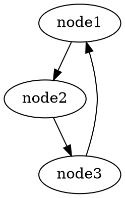
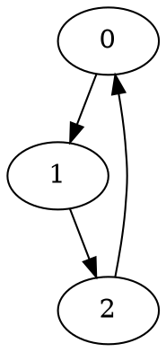

# Directed Graph Analysis Tool: Fagiolo Clustering and Small-Worldness Metrics

## Overview

A Python tool for computing Fagiolo clustering coefficients and applying them to small-world network calculations. Computes multiple clustering variants across different graph scopes and calculates small-worldness metrics for directed graphs.

---

## Table of Contents

1. [System Requirements](#system-requirements)
2. [Installation](#installation)
3. [Usage](#usage)
4. [Methodology](#methodology)
5. [Input Format](#input-format)
6. [Output Format](#output-format)

---

## System Requirements

- **Python**: 3.8 or higher
- **Operating System**: Windows, macOS, or Linux
- **Memory**: Minimum 4 GB RAM
- **Dependencies**: See `requirements.txt`

---

## Installation

```bash
# Clone the repository
git clone <repository-url>
cd small-world-property

# Create and activate virtual environment
python -m venv venv
venv\Scripts\activate  # Windows
source venv/bin/activate  # macOS/Linux

# Install dependencies
pip install -r requirements.txt

# Verify installation
python pipeline.py --help
```

---

## Methodology

The analysis pipeline processes a directed graph through the following phases:

1. **Graph Loading**: Parse DOT file and build NetworkX DiGraph
2. **Basic Metrics**: Compute nodes, edges, density, and degree statistics
3. **Connected Components**: Identify and characterize strongly connected components (SCCs)
4. **Path Length**: Calculate average shortest path lengths
5. **Clustering Coefficients**: Compute Fagiolo clustering coefficients for three scopes (full graph, LSCC, AllSCC) and five variants (overall, cycle, middleman, in-pattern, out-pattern)
6. **Random Baseline**: Generate random graphs preserving degree sequence
7. **Small-Worldness**: Calculate sigma values comparing original to random baseline metrics

### Key Metrics

- **Clustering Coefficients**: Five directed clustering variants computed across three graph scopes (15 total values)
- **Path Lengths**: Average shortest path within LSCC, AllSCC, and undirected variants
- **Small-Worldness (Sigma)**: Ratio of clustering and path-length compared to random baseline. Values > 1 indicate small-world properties.

---

## Usage

```bash
python pipeline.py <input.dot> <output.csv> [options]
```

### Options

- `-p, --per-node <file>`: Export per-node metrics
- `-r, --random-iterations <N>`: Number of random graphs for baseline (default: 10)

### Examples

```bash
# Basic analysis
python pipeline.py graph.dot results.csv

# With per-node metrics
python pipeline.py graph.dot summary.csv --per-node nodes.csv

# With 50 random baseline graphs
python pipeline.py graph.dot results.csv --random-iterations 50
```

---

## Input Format

The tool accepts directed graphs in GraphViz DOT format (.dot files).

### Basic Example


```dot
digraph GraphName {
    node1 -> node2;
    node2 -> node3;
    node3 -> node1;
}
```

### With Node Names (Optional)

Add comments to label nodes for per-node output:


```dot
digraph G {
    // 0:NodeA
    // 1:NodeB
    // 2:NodeC
    
    0 -> 1;
    1 -> 2;
    2 -> 0;
}
```

Format: `// <node_id>:<node_name>`

### Supported Features

- Directed edges: `A -> B`
- Weighted edges: `A -> B [weight=2.5]` (weights preserved but not used in clustering)
- Self-loops: `A -> A` (automatically excluded from random graphs)
- Node attributes: Optional labels and other GraphViz attributes

---

## Output Format

### Summary CSV File

The tool generates a single-row CSV containing all computed metrics:

**Basic Statistics**: nodes, edges, density, degree statistics

**Path Lengths**: average shortest paths for LSCC, AllSCC, and undirected variants

**SCC Coverage**: number and distribution of strongly connected components

**Clustering Coefficients** (15 values): Five variants (overall, cycle, middleman, in-pattern, out-pattern) across three scopes (full, LSCC, AllSCC)

**Random Baseline Metrics**: Mean and standard deviation of clustering and path lengths from random graphs

**Small-Worldness (Sigma)**: 45 sigma values (5 clustering variants × 3 scopes × 3 path-length variants)

**Small-World Classification**: Boolean flags for each sigma value (True if σ > 1)

### Per-Node CSV (Optional)

When using `--per-node`, outputs one row per node with:

- Node ID and name
- In-degree, out-degree, total degree
- Bilateral degree (reciprocal edges)
- Five clustering coefficients (overall, cycle, middleman, in-pattern, out-pattern)

Data sorted by total degree in descending order.

---

## License

This work is provided under the MIT License. See LICENSE file for details.
